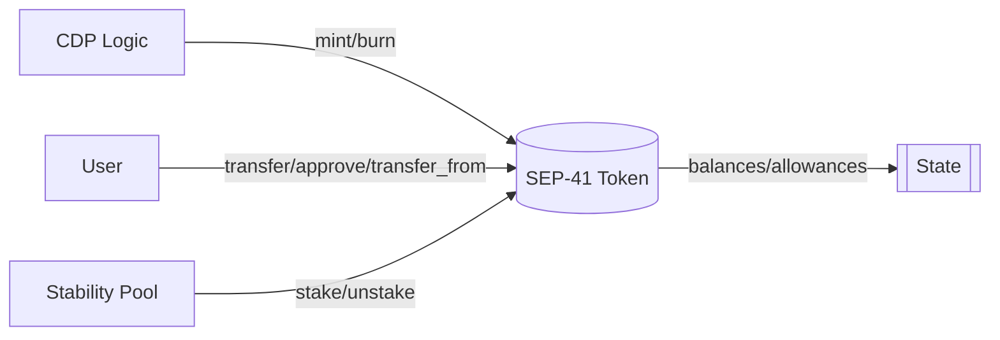

# <center>EquitX Use Case</center>

> <center>Author: Matias Aguilar • Oct 2025</center>

---

### 1. Architecture

#### 1.1 Data Feed (Oracle)
- Purpose: Implements SEP-40 for price oracles.
- Functionalities: Stores prices, provides historical data, manages multiple assets.
- Interfaces: `IsSep40`, `IsSep40Admin`.
- Implementation: `data_feed.rs` (Soroban SEP-40 standard)
  - Stores `asset → Map<timestamp, price>`
  - Admin can `set_asset_price()` manually
  - xAsset queries `lastprice_xlm()` and `lastprice_asset()` to calculate CR


<br>

```mermaid
flowchart LR
    Admin -- set_asset_price(symbol, price, ts) --> DF[(SEP-40 Data Feed)]

    DF --> S[(Storage: asset → {ts → price})]
    
    xAsset -- lastprice_xlm() / lastprice_asset() --> DF
    DF -- (price, decimals, ts) --> xAsset
```

---

#### 1.2 xAsset (Core)
- Purpose: Main DeFi contract (token, CDP, Stability Pool, liquidations).
- Functionalities: CDPs, Stability Pool, SEP-41 token, interest, liquidations.
- Interfaces: `IsCollateralized`, `IsCDPAdmin`, `IsStabilityPool`, `IsSep41`.
- Implementation in `token.rs` (1643 lines):
  - **CDPs**: `open_cdp`, `borrow_xasset`, `repay_debt`, `liquidate_cdp`
  - **Stability Pool**: `stake`, `withdraw_stake`, `claim_rewards`, reward calculation with `product_constant`/`compounded_constant`
  - **SEP-41 Token**: `mint`, `burn`, `transfer`, `approve` (balance and supply)
  - **Oracle integration**: queries Data Feed prices for CR, liquidations, and interest



---

#### 1.3 Orchestrator
- Purpose: Centralized management/deployment of xAssets.
- Functionalities: Deploys xAssets, configures, updates, controls admin access.
- Implementation in `orchestrator.rs`:
  - Stores xAsset WASM hash and registers `symbol → contract_address`
  - `deploy_asset_contract()` creates xAsset instances with initial parameters
  - `update_xasset_wasm_hash()` allows contract upgrades
  - Centralized admin control for sensitive operations

---

### 2. Roles

| Role | Key Actions | Code |
| --- | --- | --- |
| Orchestrator Admin | deploy, register symbol → contract, update wasm, upgrades | `orchestrator.rs` → `deploy_asset_contract`, `update_xasset_wasm_hash`, `upgrade` |
| xAsset Admin | `cdp_init`, set `xlm_sac`/oracles/peg/MCR/rate, `mint`/`clawback`/`set_admin` | `token.rs` → `cdp_init`, `set_min_collat_ratio`, `set_interest_rate`, `mint`, `clawback` |
| Data Feed Admin | `sep40_init`, `add_assets`, `set_asset_price` | `data_feed.rs` → `sep40_init`, `add_assets`, `set_asset_price` |
| Lender (CDP) | `open_cdp`, `add/withdraw_collateral`, `borrow_xasset`, `repay_debt`, `close_cdp` | `token.rs` → `open_cdp`, `add_collateral`, `withdraw_collateral`, `borrow_xasset`, `repay_debt`, `close_cdp` |
| Staker (Pool) | deposit/withdraw, claim rewards | `token.rs` → `stake`, `withdraw_stake`, `claim_rewards` |
| Liquidator | `liquidate_cdp` | `token.rs` → `liquidate_cdp` |

---


### 3. Findings

#### 1. **Issue:** Lack of validation for critical parameters
- Impact: Extreme parameters (MCR, rate) can allow theft or render the system unusable.
- Recommendation: Validate safe ranges for `min_collat_ratio`, `annual_interest_rate`, and `decimals`.
 - Location:
   - contracts/xasset-orchestrator/src/orchestrator.rs → `deploy_asset_contract` (passes parameters without validation)
   - contracts/xasset/src/token.rs → `set_min_collat_ratio`, `set_interest_rate`


#### [Link code –> `fn deploy_asset_contract`](https://github.com/EquitXCompany/equitx-project/blob/main/contracts/xasset-orchestrator/src/orchestrator.rs#L86-L125)

#### [Link code -> `fn set_min_collat_ratio`](https://github.com/EquitXCompany/equitx-project/blob/main/contracts/xasset/src/token.rs#L1678-L1685)

#### [Link code -> `fn set_interest_rate`](https://github.com/EquitXCompany/equitx-project/blob/main/contracts/xasset/src/token.rs#L1688-L1692)

---

#### 2. **Issue:** Critical dependence on centralized oracles
- Impact: Price manipulation/delays; incorrect liquidations; single point of failure.
- Recommendation: Multiple oracles with consensus, deviation limits, and TWAP.

---

#### 3. **Issue:** Financial calculations without overflow protection
- Impact: Incorrect debt/CR calculations; fund loss or protocol lockup.
- Recommendation: Use checked_* operations and safe functions for interest and CR.
- Location:
   - contracts/xasset/src/token.rs → function `calculate_collateralization_ratio` (initial section of the file).
   - contracts/xasset/src/token.rs → Stability Pool constant/interest updates (`update_constants`) and related calculations. 

#### [Link code -> `fn calculate_collateralization_ratio`](https://github.com/EquitXCompany/equitx-project/blob/main/contracts/xasset/src/token.rs#L62-L88)

#### [Link code -> `fn update_constants`](https://github.com/EquitXCompany/equitx-project/blob/main/contracts/xasset/src/token.rs#L655-L675)

---

#### 4. **Issue:** Full admin control without time locks
- Impact: Immediate critical changes; risk if key is compromised; low transparency.
- Recommendation: Mandatory timelock (24–48h) and multisig, events and cancellation during queue.
  - Location:
    - contracts/xasset-orchestrator/src/orchestrator.rs → `update_xasset_wasm_hash`, `upgrade`, `set_*`, `require_admin`.
    - contracts/xasset/src/token.rs → `set_min_collat_ratio`, `set_interest_rate`, `set_admin`, `mint`, `clawback`.

#### [Link code -> `fn update_xasset_wasm_hash`](https://github.com/EquitXCompany/equitx-project/blob/main/contracts/xasset-orchestrator/src/orchestrator.rs#L76-L83)

#### [Link code -> `fn upgrade`](https://github.com/EquitXCompany/equitx-project/blob/main/contracts/xasset-orchestrator/src/orchestrator.rs#L188-L192)

#### [Link code -> `fn require_admin`](https://github.com/EquitXCompany/equitx-project/blob/main/contracts/xasset-orchestrator/src/orchestrator.rs#L76-L83)

#### [Link code -> `fn set_min_collat_ratio`](https://github.com/EquitXCompany/equitx-project/blob/main/contracts/xasset/src/token.rs#L1679-L1685)

#### [Link code -> `fn set_interest_rate`](https://github.com/EquitXCompany/equitx-project/blob/main/contracts/xasset/src/token.rs#L1688-L1692)

#### [Link code -> `fn set_admin`](https://github.com/EquitXCompany/equitx-project/blob/main/contracts/xasset/src/token.rs#L272-L278)

#### [Link code -> `fn mint`](https://github.com/EquitXCompany/equitx-project/blob/main/contracts/xasset/src/token.rs#L491-L495)

#### [Link code -> `fn clawback`](https://github.com/EquitXCompany/equitx-project/blob/main/contracts/xasset/src/token.rs#L390-L403)

---

#### 5. **Issue:** Monolithic architecture with high complexity
- Impact: Difficult auditing and maintenance, higher bug risk due to coupling.
- Recommendation: Modularize (CDP, Pool, Interest, Token) and coordinate with an orchestrator contract.

---

### 4. Suggested Steps

1. **Naming improvement**: Rename functions `xlm_contract()` and `set_xlm_contract()` to `xlm_oracle()` / `set_xlm_oracle()` or `oracle_contract()` / `set_oracle_contract()`.
   - Location: `IsCollateralized`, `IsCDPAdmin`
   
2. **Use of `panic` in error handling**: Replace `panic!()` with `Result<T, Error>` with custom errors defined in separate files.
   - Impact: Improved reusability, consistency, and readability in production.

---
